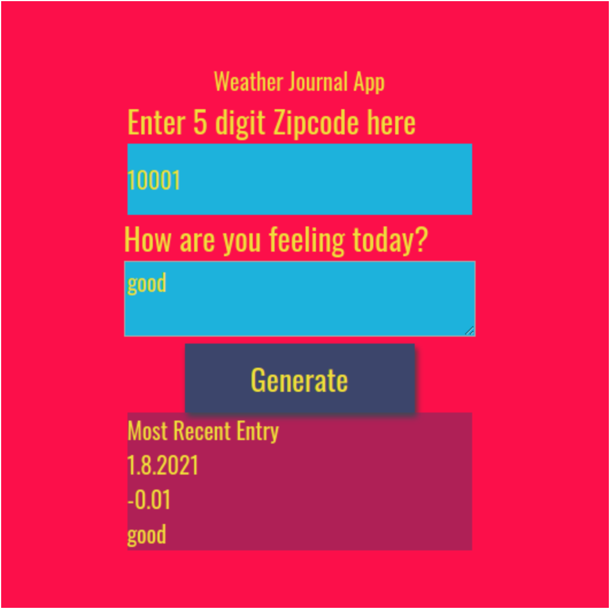

# Weather-Journal App
This project creates an asynchronous web app that uses a weather web API and input by the user to pass data between client and server-side and dynamically update the UI of the page. Check it out if you want to learn more about setting up a local server, writing GET and POST server and client-side code, and how to use data from an API and from user input to change the content of a web page. Enjoy!

## Requirements
Start by setting up your project environment. 
1. Download and [install Node](https://nodejs.org/en/download/).
2. The packages `express`, `body-parser`, and `cors` are dependencies from the `package.js` file. Install them by typing `npm install`.
3. Go to [OpenWeatherMap](https://openweathermap.org/api) and create a free (Current Weather Data) API key
4. In the file `app.js`, replace the first part of `const apiKey = 'xxxxxxxxxxxYourAPIKeyHerexxxxxx&units=metric';` with your API key and save the file
5. Start the local server `node server.js`. You should see the message `Server is running on localhost: 9000`
6. Open `index.html` in Google Chrome
7. Enter a 5 digit US zip code such as 10023 in the first field, how you are feeling in the second and click the button. Then you should see today's date, the temperature in Celsius and the text you entered displayed in a box.

## Files of Interest
The `server.js` and the `website/app.js` files are where most of the magic happens. You can checkout `index.html` for element references, and use `style.css` to customize the style of the application.

## Acknowledgements
This project of Udacity's Fron End Web development Nanodegree. If you are interested, or just want to freshen up your Front End game, I can highly recommend the course!

